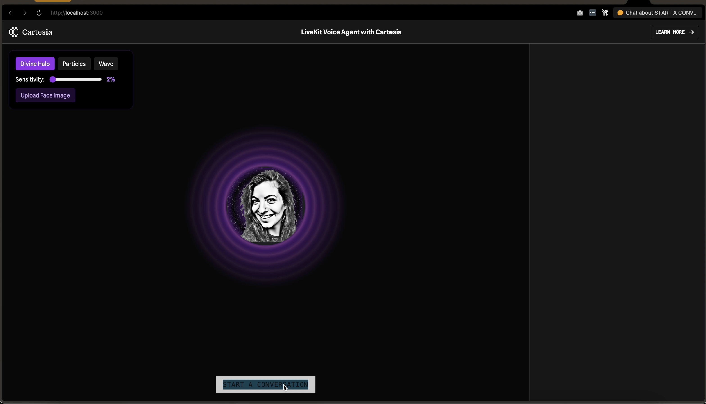

# Cartesia Voice Agent Example

This is a demo of a LiveKit [Voice Pipeline Agent](https://docs.livekit.io/agents/voice-agent/voice-pipeline/) using [Cartesia](https://www.cartesia.ai/) and GPT-4o-mini.

The example includes a custom Next.js frontend and Python agent.




## Running the example

### Prerequisites

- Node.js
- Python 3.9-3.12
- LiveKit Cloud account (or OSS LiveKit server)
- Cartesia API key (for speech synthesis)
- OpenAI API key (for LLM)
- Deepgram API key (for speech-to-text)

### Frontend

Copy `.env.example` to `.env.local` and set the environment variables. Then run:

```bash
cd frontend
npm install
npm run dev
```

### Agent

Copy `.env.example` to `.env` and set the environment variables. Then run:

```bash
cd agent
python3 -m venv venv
source venv/bin/activate
pip install -r requirements.txt
python main.py dev
```

## Railway Deployment

This project is configured for deployment on Railway. The following environment variables are required:

### Required Environment Variables
- `OPENAI_API_KEY` - Your OpenAI API key
- `LIVEKIT_API_KEY` - Your LiveKit API key  
- `LIVEKIT_API_SECRET` - Your LiveKit API secret
- `LIVEKIT_URL` - Your LiveKit server URL
- `CARTESIA_API_KEY` - Your Cartesia API key
- `DEEPGRAM_API_KEY` - Your Deepgram API key

### Optional Environment Variables
- `REDIS_URL` - Redis connection URL for enhanced session management
- `PORT` - Port number (Railway sets this automatically)

### Redis Configuration (Optional)
For improved session management and caching, you can add a Redis service:

1. In your Railway project, add a Redis service
2. Copy the Redis connection URL from the service variables
3. Set the `REDIS_URL` environment variable in your main service

Without Redis, the application will use in-memory storage which works fine for single-instance deployments.
